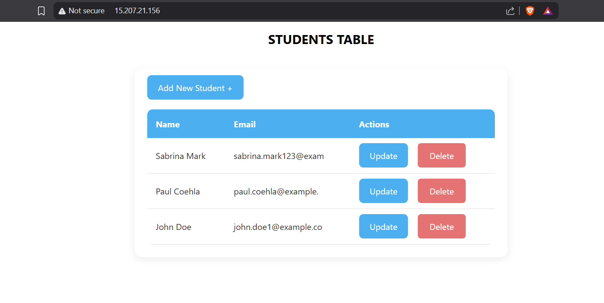
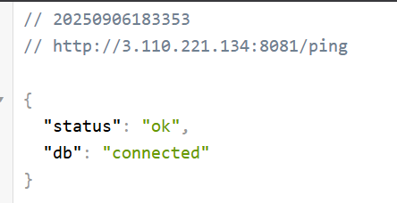
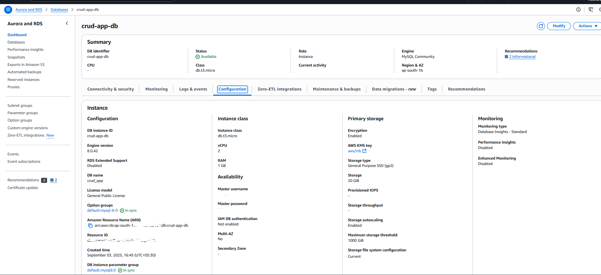
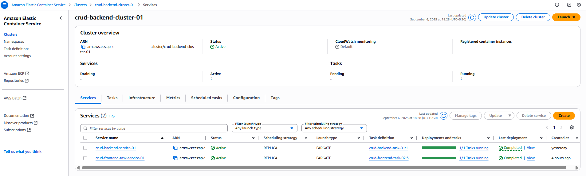
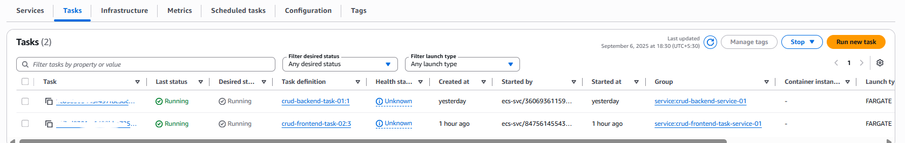

# 📚 Basic Students CRUD App

A full-stack **CRUD (Create, Read, Update, Delete)** web application built using **React**, **Node.js (Express)**, **MySQL**, **Docker**, and **AWS services** (ECR, ECS, RDS). This project demonstrates modern web development practices including containerization, cloud deployment, and environment-based configuration.

---

## ✅ Features

- 🔥 **Frontend** built with React, Axios for API calls
- 🚀 **Backend** with Node.js, Express, and MySQL
- 📦 **Dockerized** frontend and backend for portability and scalability
- ☁️ **AWS Deployment** using ECS (Elastic Container Service) and ECR (Elastic Container Registry)
- 🗄 **Database** hosted on AWS RDS (MySQL)
- 🔐 Secure database connection with restricted access
- 🌐 Public URLs for frontend and backend with environment-based configurations

---

## ✅ Tech Stack

- **Frontend:** React, Axios, environment variables (.env)
- **Backend:** Node.js, Express, MySQL2, dotenv
- **Database:** AWS RDS MySQL instance
- **Containerization:** Docker (images, tags, push, etc.)
- **Cloud Services:** AWS ECR, AWS ECS, AWS RDS, Security Groups
- **Security:** Environment variables, restricted access via inbound rules

---


## ✅ Getting Started

### Prerequisites

- Docker installed
- AWS account with access to ECR, ECS, and RDS
- Node.js installed (for local testing)

---

### Run Locally

```bash
# Navigate to backend folder
cd backend
npm install
npm start

# Navigate to frontend folder
cd frontend
npm install
npm start
```

## ✅ Docker setup
```bash
# Build and tag backend image

docker build -t basic_crud_app-backend .

# Push backend image to AWS ECR

docker tag basic_crud_app-backend:latest <aws_account_id>.dkr.ecr.<region>.amazonaws.com/crud-app-backend:latest
docker push <aws_account_id>.dkr.ecr.<region>.amazonaws.com/crud-app-backend:latest

# Repeat for frontend

docker build -t basic_crud_app-frontend .
docker tag basic_crud_app-frontend:latest <aws_account_id>.dkr.ecr.<region>.amazonaws.com/crud-app-frontend:latest
docker push <aws_account_id>.dkr.ecr.<region>.amazonaws.com/crud-app-frontend:latest
```

## ✅ AWS Deployment

1. Create ECS cluster
2. Define task definitions with appropriate CPU, memory, and environment variables
3. Deploy frontend and backend containers
4. Configure RDS for MySQL with secure access
5. Set up security groups for controlled access

---

## ✅ Screenshots

1. **Frontend UI**



2. **Backend Console Logs**



3. **Docker Setup**


4. **AWS Console Screenshots**





---
